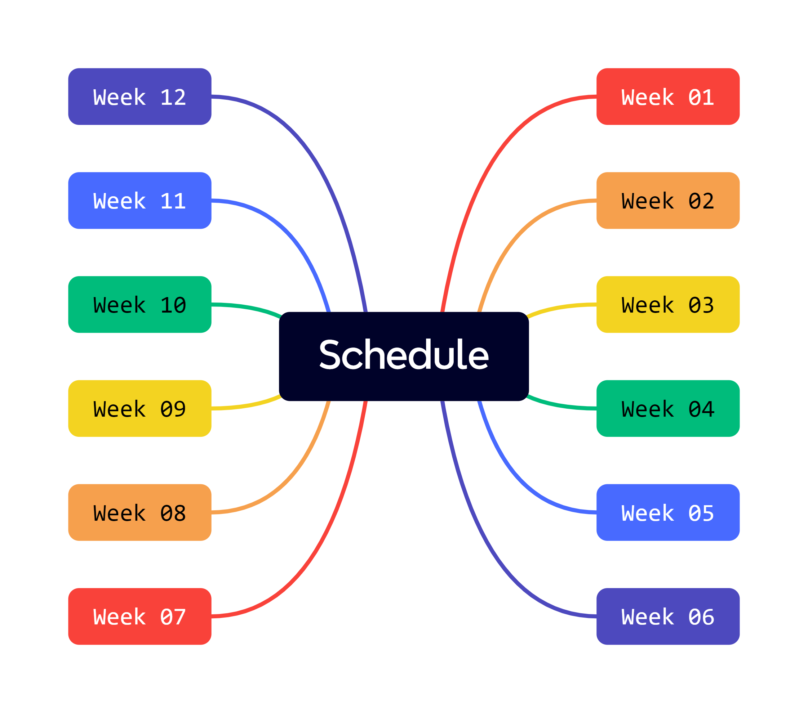

# Information Technology

This repository is for the _Information Technology in Surveying Engineering_ course that I teaching assistant in Winter 2024 at the [University of Noshirvani, Babol](https://nit.ac.ir/en).

This course will be focus on the `Python programming language`. The course schedule is as follows:

- Week 1: `Python Basic Data Types`
- Week 2: `String + List`
- Week 3: `Tuple + Dictionary`
- Week 4: `Set + Frozenset`
- Week 5: `Loop (for - while)`
- Week 6: `Function`
- Week 7: `Lambda + Map + Filter`
- Week 8: `Project (password generator) - function`
- Week 9: `File I/O`
- Week 10: `Object Oriented Programming (OOP)`
- Week 11: `Project (password generator) - class`
- Week 12: `Project (Wordle)`

## References

- [Python Documentation](https://www.python.org/doc/)
- [Real Python](https://realpython.com/)
- [W3Schools](https://www.w3schools.com/python/)
- [Pytopia](https://www.pytopia.ai/)
