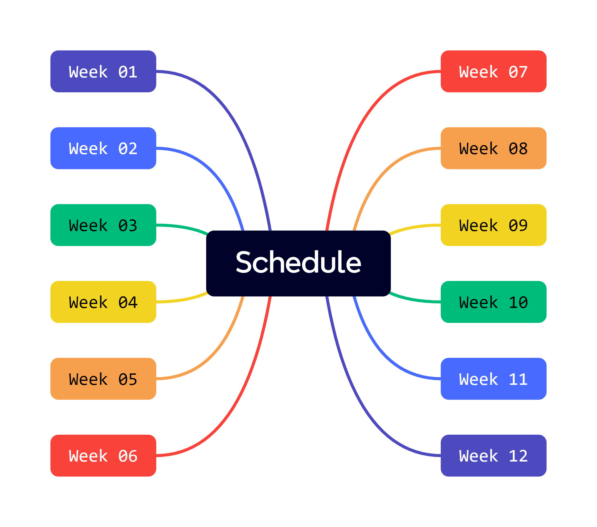

# Information Technology

This repository is for the _Information Technology in Surveying Engineering_ course that I teaching assistant in Winter 2024 at the [University of Noshirvani, Babol](https://nit.ac.ir/en).

This course will be focus on the `Python programming language`. The course schedule is as follows:

## Table of Course Content

| Weeks | Topic | Weeks | Topic | Weeks | Topic |
| :-----: | :-----: | :-----: | :-----: | :-----: | :-----: |
| 01 | [Python Basic Data Types](https://github.com/Yousefess/TA24PY/tree/main/Weeks/01%20Python%20Basic%20Data%20Types) | 02 | [String + List](https://github.com/Yousefess/TA24PY/tree/main/Weeks/02%20String%20%2B%20List) | 03 | [Tuple + Dictionary](https://github.com/Yousefess/TA24PY/tree/main/Weeks/03%20Tuple%20%2B%20Dictionary) |
| 04 | [Set + Conditional Statement](https://github.com/Yousefess/TA24PY/tree/main/Weeks/04%20Set%20%2B%20Condition/Notebooks) | 05 | [Loop](https://github.com/Yousefess/TA24PY/tree/main/Weeks/05%20Loop)| 06 | [Function](https://github.com/Yousefess/TA24PY/tree/main/Weeks/06%20Function) |
| 07 | [Function](https://github.com/Yousefess/TA24PY/tree/main/Weeks/07%20Function/Notebooks) | 08 | [Project (Password Generator Dashboard)](https://github.com/Yousefess/TA24PY/tree/main/Weeks/08%20Project%20(Password%20Generator%20Dashboard)) | 09 | [File Handling](https://github.com/Yousefess/TA24PY/tree/main/Weeks/09%20File%20Handling) |

---

## References

- [Python Documentation](https://www.python.org/doc/)
- [Real Python](https://realpython.com/)
- [W3Schools](https://www.w3schools.com/python/)
- [Pytopia](https://www.pytopia.ai/)
