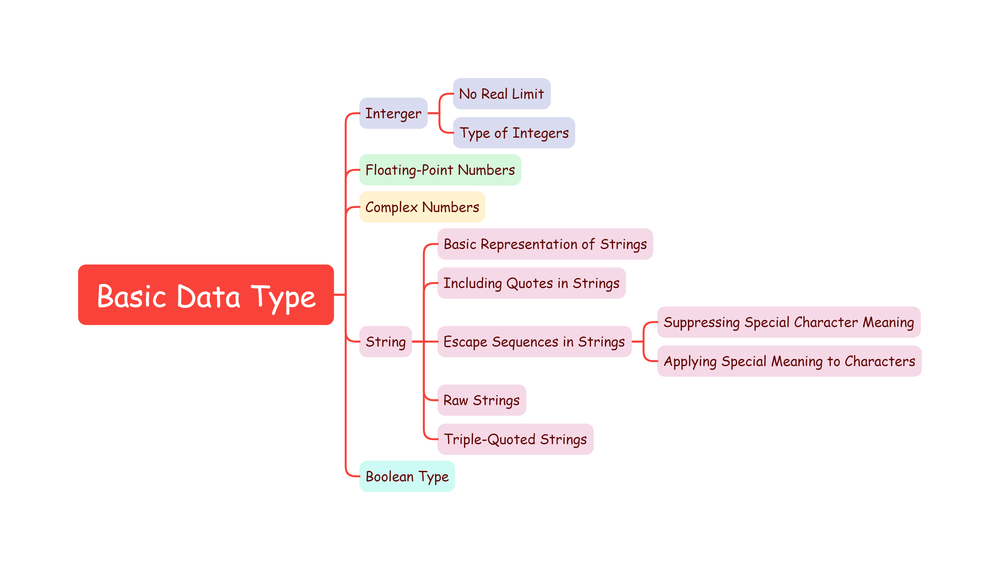
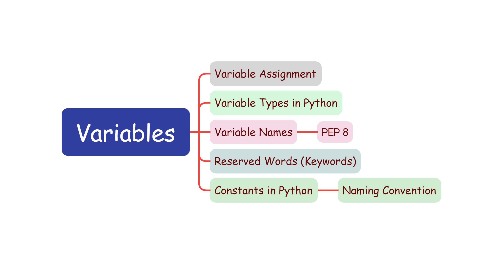
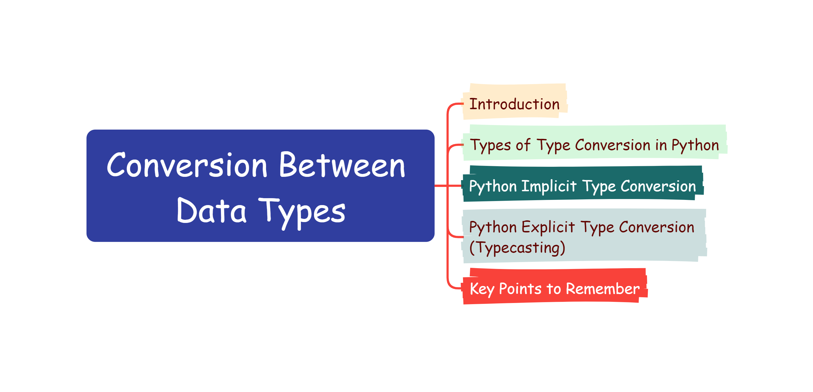
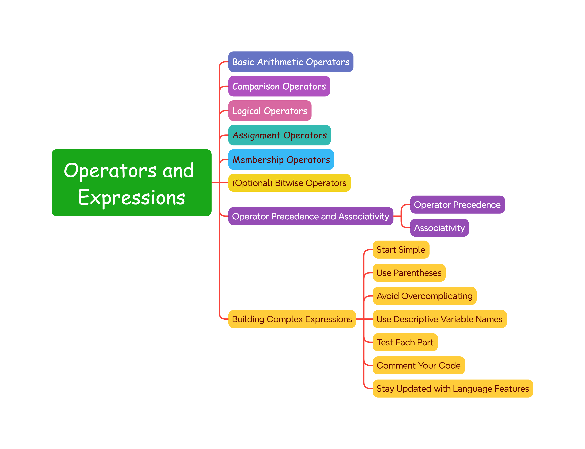

# Python Basic Data Types

## [**`Basic Data Types`**](https://github.com/Yousefess/TA24PY/blob/main/Weeks/01%20Python%20Basic%20Data%20Types/Notebooks/01%20Basic%20Data%20Types.ipynb)

## [**`Variables`**](https://github.com/Yousefess/TA24PY/blob/main/Weeks/01%20Python%20Basic%20Data%20Types/Notebooks/02%20Variables.ipynb)

## [**`Conversion Between Data Types`**](https://github.com/Yousefess/TA24PY/blob/main/Weeks/01%20Python%20Basic%20Data%20Types/Notebooks/03%20Conversion%20Between%20Data%20Types.ipynb)

## [**`Operators and Expressions`**](https://github.com/Yousefess/TA24PY/blob/main/Weeks/01%20Python%20Basic%20Data%20Types/Notebooks/04%20Operators%20and%20Expresssions.ipynb)

